Analiza danych statystycznych dotyczących liczby studentów według typów
uczelni w Polsce w latach 2000-2018
================

Przedstawione dane odnoszą się do liczby studentów wg typów uczelni w
latach 2000 - 2018. Dotyczą one wszystkich rodzajów studiów zarówno
magisterskich jednolitych, jak i pierwszego oraz drugiego stopnia.
Wzięto pod uwagę uniwersytety, uczelnie techniczne, rolnicze,
ekonomiczne, pedagogiczne, morskie, medyczne, artystyczne, teologiczne i
akademie wychowania
fizycznego.

## Liczba studentów według typów uczelni na podstawie danych Głównego Urzędu Statystycznego

``` r
tabela

```
| Rok | Ogolem | Uniwersytety | Uczelnie techniczne | Uczelnie rolnicze | Uczelnie ekonomiczne | Uczelnie pedagogiczne | Uczelnie morskie | Uniwersytety medyczne | Akademie wychowania fizycznego | Uczelnie artystyczne | Uczelnie teologiczne |
|:----:|:-------:|:------------:|:-------------------:|:-----------------:|:--------------------:|:---------------------:|:----------------:|:---------------------:|:------------------------------:|:--------------------:|:--------------------:|
| 2000 | 1448867 | 443291 | 318377 | 85539 | 369498 | 148293 | 10135 | 29487 | 22171 | 12793 | 9283 |
| 2001 | 1547364 | 510145 | 334511 | 91339 | 386596 | 134089 | 11688 | 32824 | 23010 | 13314 | 9848 |
| 2002 | 1603355 | 531139 | 344906 | 98408 | 390479 | 138973 | 12425 | 38742 | 23790 | 14316 | 10177 |
| 2003 | 1613607 | 543368 | 342407 | 104077 | 382319 | 137204 | 12216 | 42360 | 24893 | 14563 | 10200 |
| 2004 | 1633481 | 554878 | 340219 | 107645 | 387878 | 133800 | 12111 | 44460 | 26951 | 15101 | 10438 |
| 2005 | 1635699 | 563062 | 331052 | 107696 | 407755 | 111846 | 11476 | 48842 | 28157 | 15391 | 10422 |
| 2006 | 1603168 | 550494 | 318905 | 91997 | 406171 | 117409 | 10500 | 53060 | 29048 | 14932 | 10652 |
| 2007 | 1580747 | 538208 | 310555 | 89735 | 410810 | 110334 | 9921 | 56114 | 28713 | 15377 | 10980 |
| 2008 | 1519707 | 526381 | 322111 | 87556 | 356561 | 107668 | 10103 | 58015 | 28184 | 15736 | 7392 |
| 2009 | 1472819 | 535576 | 317468 | 81245 | 309991 | 106822 | 9977 | 59922 | 28206 | 16132 | 7480 |
| 2010 | 1430154 | 526796 | 318738 | 80494 | 278425 | 102540 | 10402 | 61957 | 27574 | 16444 | 6784 |
| 2011 | 1379699 | 516237 | 337828 | 80430 | 248642 | 73585 | 10566 | 61210 | 27231 | 16970 | 7000 |
| 2012 | 1324540 | 492939 | 343083 | 79403 | 223467 | 64956 | 10398 | 60595 | 26459 | 17134 | 6106 |
| 2013 | 1233911 | 454225 | 331099 | 76064 | 199409 | 54921 | 10064 | 59665 | 25335 | 17065 | 6064 |
| 2014 | 1179173 | 434371 | 319019 | 73491 | 186608 | 49005 | 9647 | 59691 | 24570 | 17255 | 5516 |
| 2015 | 1136382 | 421772 | 301412 | 70792 | 179122 | 46122 | 9436 | 60606 | 24727 | 16938 | 5455 |
| 2016 | 1092799 | 403330 | 285165 | 68031 | 173849 | 43751 | 8911 | 62270 | 24754 | 17082 | 5656 |
| 2017 | 1038346 | 388373 | 258007 | 62355 | 172636 | 40632 | 8157 | 64275 | 21361 | 17192 | 5358 |
| 2018 | 981470 | 363280 | 235134 | 56747 | 172353 | 39902 | 7387 | 65423 | 19383 | 16813 | 5048 |

## Ogólna liczba studentów na wszystkich typach uczelni w latach 2000 - 2018

``` r
par(mar=c(8,8,0,3), mgp=c(7,2,0))
barplot(tabela$Ogolem,xlab="Lata",ylab="Liczba studentów",names.arg=c(2000:2018),las=2,ylim=c(600000,max(tabela$Ogolem)), xpd=FALSE, col="burlywood3", beside=TRUE)
```

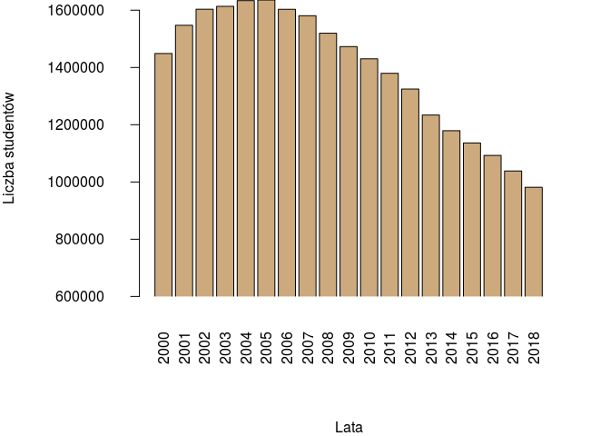<!-- -->

Średnia roczna liczba studentów na wszystkich typach uczelni:

``` r
mean(tabela$Ogolem)
```

    ## [1] 1392384

Wariancja:

``` r
var(tabela$Ogolem)
```

    ## [1] 48156846703

Odchylenie standardowe:

``` r
sd(tabela$Ogolem)
```

    ## [1] 219446.7

Rozstęp próby:

``` r
diff(range(tabela$Ogolem))
```

    ## [1] 654229

Odchylenie przeciętne:

``` r
avg.dev <- function(x) mean(abs(x - mean(x)))
avg.dev(tabela$Ogolem)
```

    ## [1] 186605.1

Kwartyle:

``` r
fx <- fivenum(tabela$Ogolem)
names(fx) <- c("Minimum", "Q1", "Mediana", "Q3", "Maksimum")
fx
```

    ##  Minimum       Q1  Mediana       Q3 Maksimum 
    ##   981470  1206542  1448867  1591958  1635699

Rozstęp międzykwartylowy:

``` r
iqr2 <- function(x) diff(fivenum(x)[c(2, 4)])
iqr2(tabela$Ogolem)
```

    ## [1] 385415.5

<br /> Interpretacja wyników rocznej liczby studentów na wszystkich
typach uczelni w latach 2000 - 2018: <br /> 1. Wartość kwartyla
pierwszego wyniosła 1 206 542, co oznacza, że 25% ilości osób
studiujących w ciągu roku jest mniejsza lub równa tej wartości, a 75%
jest większa. <br /> 2. Wartość kwartyla drugiego (mediany) wyniosła 1
448 867, co oznacza, że 50% ilości osób studiujących w ciągu roku jest
mniejsza lub równa tej wartości, a 50% jest większa. <br /> 3. Wartość
kwartyla trzeciego wyniosła 1 591 958, co oznacza, że 75% ilości osób
studiujących w ciągu roku jest mniejsza lub równa tej wartości, a 25%
jest większa. <br /> 4. Odchylenie standardowe wyniosło 219 446.7, co
oznacza, że typowa ilość osób studiujących w ciągu roku znajduje się w
przedziale od 1 172 937 do 1 611 851. <br/> 5. Największą ilość
studentów w liczbie 1 635 699 zaobserwowano w 2005 roku, a najmniejszą
wynoszącą 981 470 w 2018 roku. Rozstęp próby wyniósł więc 654 229.

<br/> <br /> W celu próby zbadania postępującego trendu spadkowego w
ilości studentów postanowiliśmy poszukać danych odnośnie ilości
maturzystów <br />Zebrane dane zostały przedstawione w tabeli poniżej,
niestety dane dostępne odnośnie maturzystów sięgają 2006 roku.

``` r
maturzysci
```

|| Rok | Maturzysci | Studenci | Roznica
--- |:---:|:---:|:---:|:---:
1 |  2006 |     420000 |  1603168 | 1183168
2 |  2007 |     422991 |  1580747 | 1157756
3 |  2008 |     415000 |  1519707 | 1104707
4 |  2009 |    426171  | 1472819 | 1046648
5 |  2010 |     366623 |  1430154 | 1063531
6 |  2011 |     343824 | 1379699 | 1035875
7 |  2012 |     330018 | 1324540 | 994522
8 |  2013 |     314485 |  1233911 | 919426
9 |  2014 |     293974 |  1179173 |  885199
10 |  2015 |     275568 |  1136382 | 860814
11 |  2016 |     258372  | 1092799 |  834427
12 |  2017 |     258030  | 1038346 | 780316
13 |  2018 |     247840  | 981470  |733630

## Wykres przedstawiający zależność liczby studentów od liczby maturzystów na przestrzeni lat wraz z dopasowaną regresją liniową.

``` r
model <- lm( Maturzysci ~ Studenci, data=maturzysci)
 plot( maturzysci$Studenci, maturzysci$Maturzysci, xlab="Liczba studentów",ylab="Liczba maturzystów")
abline(model)
 grid()
```

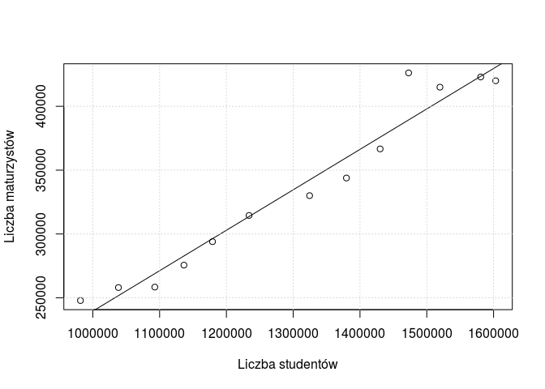<!-- --> <br />Na
podstawie powyższego wykresu można wyciągnąć wnioski, że liczba
studentów jest liniowo skorelowana z liczbą maturzystów. <br />Więcej
wniosków i przypuszczeń postaramy się zawrzeć w podsumowaniu.
<br /><br />

## Rozkład studentów na poszczególne uczelnie w 2000 roku

``` r
par(mar=c(8,8,0,3), mgp=c(7,2,0))
options(scipen=5)
barplot( df2$"2000",ylab="Liczba studentów",las=2,names.arg=c("Uniwesytety", "Techniczne", "Rolnicze", "Ekonomiczne", "Pedagogiczne", "Morskie", "Medyczne", "AWF", "Artystyczne", "Teologiczne"),ylim=c(0,520000),xpd=FALSE,col="burlywood3",beside=TRUE)
```

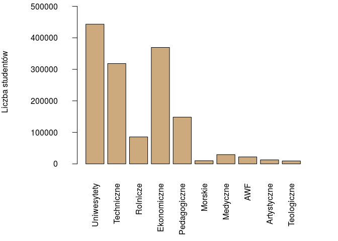<!-- -->

## Rozkład studentów na poszczególne uczelnie w 2018 roku w tej samej skali co poprzedni wykres

``` r
par(mar=c(8,8,0,3), mgp=c(7,2,0))
options(scipen=5)
barplot( df2$"2018",ylab="Liczba studentów",las=2,names.arg=c("Uniwesytety", "Techniczne", "Rolnicze", "Ekonomiczne", "Pedagogiczne", "Morskie", "Medyczne", "AWF", "Artystyczne", "Teologiczne"),ylim=c(0,520000),xpd=FALSE,col="burlywood3",beside=TRUE)
```

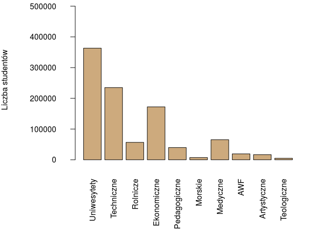<!-- -->

Na podstawie powyższych wykresów można zauważyć, że mimo upływu lat
rozkład studentów na poszczególnych uczelniach nie zmienił się
diametralnie. Uniwersytety nadal przyciągają spore grono studentów.
Widocznymi wyjątkami są uczelnie ekonomiczne, które zanotowały wyraźny
spadek popularności oraz uczelnie medyczne, którymi zainteresowanie
wciąż rośnie.

## Liczba studentów na uniwersytetach w latach 2000 - 2018

``` r
par(mar=c(8,8,0,3), mgp=c(7,2,0))
options(scipen=5)
barplot(tabela$Uniwersytety,xlab="Lata",ylab="Liczba studentów",names.arg=c(2000:2018),las=2,ylim=c(100000,max(tabela$Uniwersytety)), xpd=FALSE, col="burlywood3", beside=TRUE)
```

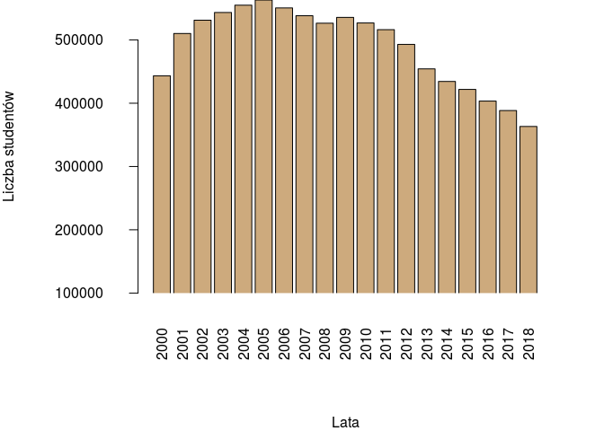<!-- -->

Średnia roczna liczba studentów na uniwersytetach:

``` r
mean(tabela$Uniwersytety)
```

    ## [1] 489361.3

Wariancja:

``` r
var(tabela$Uniwersytety)
```

    ## [1] 3946111732

Odchylenie standardowe:

``` r
sd(tabela$Uniwersytety)
```

    ## [1] 62818.08

Rozstęp próby:

``` r
diff(range(tabela$Uniwersytety))
```

    ## [1] 199782

Odchylenie przeciętne:

``` r
avg.dev(tabela$Uniwersytety)
```

    ## [1] 54409.18

Kwartyle:

``` r
fx <- fivenum(tabela$Uniwersytety)
names(fx) <- c("Minimum", "Q1", "Mediana", "Q3", "Maksimum")
fx
```

    ##  Minimum       Q1  Mediana       Q3 Maksimum 
    ##   363280   438831   516237   536892   563062

Rozstęp międzykwartylowy:

``` r
iqr2(tabela$Uniwersytety)
```

    ## [1] 98061

Procent liczby studentów na uniwersytetach w stosunku do uczelni
wyższych w 2000 roku

``` r
stos2000<-tabela$Uniwersytety[1]/ tabela$Ogolem[1]
stos2000*100
```

    ## [1] 30.5957

Procent liczby studentów na uniwersytetach w stosunku do uczelni
wyższych w 2018 roku

``` r
stos2018<- tabela$Uniwersytety[19]/tabela$Ogolem[19]
stos2018*100
```

    ## [1] 37.01387

<br /> Interpretacja wyników rocznej liczby studentów na uniwersytetach
w latach 2000 - 2018: <br /> 1. Wartość kwartyla pierwszego wyniosła 438
831, co oznacza, że 25% ilości osób studiujących na uniwersytetach w
ciągu roku jest mniejsza lub równa tej wartości, a 75% jest większa.
<br /> 2. Wartość kwartyla drugiego (mediany) wyniosła 516 237, co
oznacza, że 50% ilości osób studiujących na uniwersytetach w ciągu roku
jest mniejsza lub równa tej wartości, a 50% jest większa. <br /> 3.
Wartość kwartyla trzeciego wyniosła 536 892, co oznacza, że 75% ilości
osób studiujących na uniwersytetach w ciągu roku jest mniejsza lub równa
tej wartości, a 25% jest większa. <br /> 4. Odchylenie standardowe
wyniosło 62 818.08, co oznacza, że typowa ilość osób studiujących na
uniwersytetach w ciągu roku znajduje się w przedziale od 426 543 do 552
180. <br/> 5. Największą ilość studentów na uniwersytetach w liczbie 563
062 zaobserwowano w 2005 roku, a najmniejszą wynoszącą 363 280 w 2018
roku. Rozstęp próby wyniósł więc 199 782. <br/> 6. Liczba studentów na
uniwersytetach w stosunku do uczelni wyższych wzrosła o ok. 7 punktów
procentowych w latach 2000 - 2018.

## Liczba studentów na uczelniach technicznych w latach 2000 - 2018

``` r
par(mar=c(8,8,0,3), mgp=c(7,2,0))
options(scipen=5)
barplot(tabela$`Uczelnie techniczne`,xlab="Lata",ylab="Liczba studentów",names.arg=c(2000:2018),las=2,ylim=c(100000,max(tabela$`Uczelnie techniczne`)), xpd=FALSE, col="burlywood3", beside=TRUE)
```

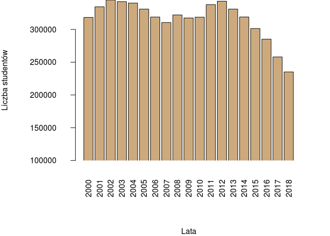<!-- -->

Średnia roczna liczba studentów na uczelniach technicznych:

``` r
mean(tabela$`Uczelnie techniczne`)
```

    ## [1] 316315.6

Wariancja:

``` r
var(tabela$`Uczelnie techniczne`)
```

    ## [1] 849480935

Odchylenie standardowe:

``` r
sd(tabela$`Uczelnie techniczne`)
```

    ## [1] 29145.86

Rozstęp próby:

``` r
diff(range(tabela$`Uczelnie techniczne`))
```

    ## [1] 109772

Odchylenie przeciętne:

``` r
avg.dev(tabela$`Uczelnie techniczne`)
```

    ## [1] 20137.36

Kwartyle:

``` r
fx <- fivenum(tabela$`Uczelnie techniczne`)
names(fx) <- c("Minimum", "Q1", "Mediana", "Q3", "Maksimum")
fx
```

    ##  Minimum       Q1  Mediana       Q3 Maksimum 
    ## 235134.0 314011.5 319019.0 336169.5 344906.0

Rozstęp międzykwartylowy:

``` r
iqr2(tabela$`Uczelnie techniczne`)
```

    ## [1] 22158

Procent liczby studentów na uczelniach technicznych w stosunku do
uczelni wyższych w 2000 roku

``` r
stos2000<-tabela$`Uczelnie techniczne`[1]/ tabela$Ogolem[1]
stos2000*100
```

    ## [1] 21.9742

Procent liczby studentów na uczelniach technicznych w stosunku do
uczelni wyższych w 2018 roku

``` r
stos2018<- tabela$`Uczelnie techniczne`[19]/tabela$Ogolem[19]
stos2018*100
```

    ## [1] 23.95733

<br /> Interpretacja wyników rocznej liczby studentów na uczelniach
technicznych w latach 2000 - 2018: <br /> 1. Wartość kwartyla pierwszego
wyniosła 314 011.5, co oznacza, że 25% ilości osób studiujących na
uczelniach technicznych w ciągu roku jest mniejsza lub równa tej
wartości, a 75% jest większa. <br /> 2. Wartość kwartyla drugiego
(mediany) wyniosła 319 019, co oznacza, że 50% ilości osób studiujących
na uczelniach technicznych w ciągu roku jest mniejsza lub równa tej
wartości, a 50% jest większa. <br /> 3. Wartość kwartyla trzeciego
wyniosła 336 169.5, co oznacza, że 75% ilości osób studiujących na
uczelniach technicznych w ciągu roku jest mniejsza lub równa tej
wartości, a 25% jest większa. <br /> 4. Odchylenie standardowe wyniosło
29 145.86, co oznacza, że typowa ilość osób studiujących na uczelniach
technicznych w ciągu roku znajduje się w przedziale od 316 169 do 330
902. <br/> 5. Największą ilość studentów na uczelniach technicznych w
liczbie 344 906 zaobserwowano w 2002 roku, a najmniejszą wynoszącą 235
134 w 2018 roku. Rozstęp próby wyniósł więc 109 772. <br/> 6. Liczba
studentów na uczelniach technicznych w stosunku do uczelni wyższych
wzrosła o ok. 2 punktów procentowych w latach 2000 - 2018.

## Liczba studentów na uczelniach rolniczych w latach 2000 - 2018

``` r
par(mar=c(8,8,0,3), mgp=c(7,2,0))
options(scipen=5)
barplot(tabela$`Uczelnie rolnicze`,xlab="Lata",ylab="Ilość studentów",names.arg=c(2000:2018),las=2,ylim=c(20000,max(tabela$`Uczelnie rolnicze`)), xpd=FALSE, col="burlywood3", beside=TRUE)
```

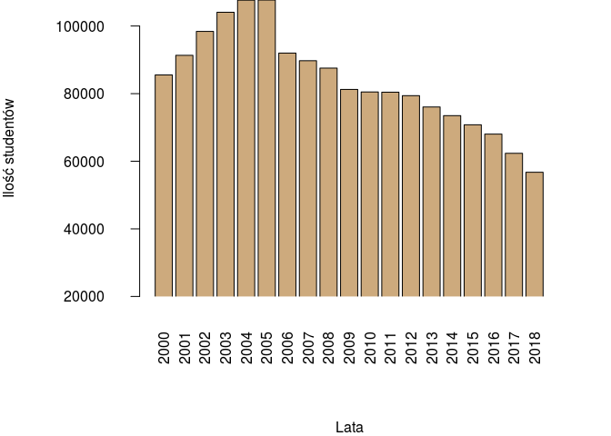<!-- -->

Średnia roczna liczba studentów na uczelniach rolniczych:

``` r
mean(tabela$`Uczelnie rolnicze`)
```

    ## [1] 83844.42

Wariancja:

``` r
var(tabela$`Uczelnie rolnicze`)
```

    ## [1] 209132809

Odchylenie standardowe:

``` r
sd(tabela$`Uczelnie rolnicze`)
```

    ## [1] 14461.42

Rozstęp próby:

``` r
diff(range(tabela$`Uczelnie rolnicze`))
```

    ## [1] 50949

Odchylenie przeciętne:

``` r
avg.dev(tabela$`Uczelnie rolnicze`)
```

    ## [1] 11514.97

Kwartyle:

``` r
fx <- fivenum(tabela$`Uczelnie rolnicze`)
names(fx) <- c("Minimum", "Q1", "Mediana", "Q3", "Maksimum")
fx
```

    ##  Minimum       Q1  Mediana       Q3 Maksimum 
    ##  56747.0  74777.5  81245.0  91668.0 107696.0

Rozstęp międzykwartylowy:

``` r
iqr2(tabela$`Uczelnie rolnicze`)
```

    ## [1] 16890.5

Procent liczby studentów na uczelniach rolniczych w stosunku do uczelni
wyższych w 2000 roku

``` r
stos2000<-tabela$`Uczelnie rolnicze`[1]/ tabela$Ogolem[1]
stos2000*100
```

    ## [1] 5.903855

Procent liczby studentów na uczelniach rolniczych w stosunku do uczelni
wyższych w 2018 roku

``` r
stos2018<- tabela$`Uczelnie rolnicze`[19]/tabela$Ogolem[19]
stos2018*100
```

    ## [1] 5.781837

<br /> Interpretacja wyników rocznej liczby studentów na uczelniach
rolniczych w latach 2000 - 2018: <br /> 1. Wartość kwartyla pierwszego
wyniosła 74 777.5, co oznacza, że 25% ilości osób studiujących na
uczelniach rolniczych w ciągu roku jest mniejsza lub równa tej wartości,
a 75% jest większa. <br /> 2. Wartość kwartyla drugiego (mediany)
wyniosła 81 245.0, co oznacza, że 50% ilości osób studiujących na
uczelniach rolniczych w ciągu roku jest mniejsza lub równa tej wartości,
a 50% jest większa. <br /> 3. Wartość kwartyla trzeciego wyniosła 91
668.0, co oznacza, że 75% ilości osób studiujących na uczelniach
rolniczych w ciągu roku jest mniejsza lub równa tej wartości, a 25% jest
większa. <br /> 4. Odchylenie standardowe wyniosło 14 461.42, co
oznacza, że typowa ilość osób studiujących na uczelniach rolniczych w
ciągu roku znajduje się w przedziale od 69 383 do 98 306. <br/> 5.
Największą ilość studentów na uczelniach rolniczych w liczbie 107 696
zaobserwowano w 2005 roku, a najmniejszą wynoszącą 56 747 w 2018 roku.
Rozstęp próby wyniósł więc 50 949. <br/> 6. Liczba studentów na
uczelniach rolniczych w stosunku do uczelni wyższych nieznacznie zmalała
o ok. 0.2 punktów procentowych w latach 2000 - 2018.

## Liczba studentów na uczelniach ekonomicznych w latach 2000 - 2018

``` r
par(mar=c(8,8,0,3), mgp=c(7,2,0))
options(scipen=5)
barplot(tabela$`Uczelnie ekonomiczne`,xlab="Lata",ylab="Liczba studentów",names.arg=c(2000:2018),las=2,ylim=c(100000,max(tabela$`Uczelnie ekonomiczne`)), xpd=FALSE, col="burlywood3", beside=TRUE)
```

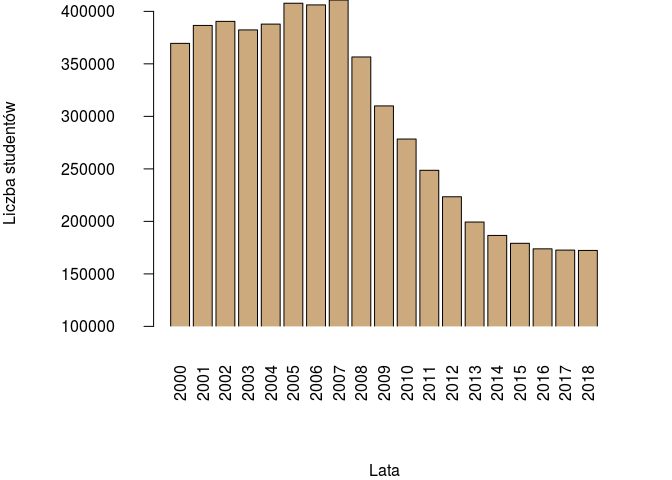<!-- -->

Średnia roczna liczba studentów na uczelniach ekonomicznych:

``` r
mean(tabela$`Uczelnie ekonomiczne`)
```

    ## [1] 296977.3

Wariancja:

``` r
var(tabela$`Uczelnie ekonomiczne`)
```

    ## [1] 9348862684

Odchylenie standardowe:

``` r
sd(tabela$`Uczelnie ekonomiczne`)
```

    ## [1] 96689.52

Rozstęp próby:

``` r
diff(range(tabela$`Uczelnie ekonomiczne`))
```

    ## [1] 238457

Odchylenie przeciętne:

``` r
avg.dev(tabela$`Uczelnie ekonomiczne`)
```

    ## [1] 88240.51

Kwartyle:

``` r
fx <- fivenum(tabela$`Uczelnie ekonomiczne`)
names(fx) <- c("Minimum", "Q1", "Mediana", "Q3", "Maksimum")
fx
```

    ##  Minimum       Q1  Mediana       Q3 Maksimum 
    ## 172353.0 193008.5 309991.0 387237.0 410810.0

Rozstęp międzykwartylowy:

``` r
iqr2(tabela$`Uczelnie ekonomiczne`)
```

    ## [1] 194228.5

Procent liczby studentów na uczelniach ekonomicznych w stosunku do
uczelni wyższych w 2000 roku

``` r
stos2000<-tabela$`Uczelnie ekonomiczne`[1]/ tabela$Ogolem[1]
stos2000*100
```

    ## [1] 25.50255

Procent liczby studentów na uczelniach ekonomicznych w stosunku do
uczelni wyższych w 2018 roku

``` r
stos2018<- tabela$`Uczelnie ekonomiczne`[19]/tabela$Ogolem[19]
stos2018*100
```

    ## [1] 17.5607

<br /> Interpretacja wyników rocznej liczby studentów na uczelniach
ekonomicznych w latach 2000 - 2018: <br /> 1. Wartość kwartyla
pierwszego wyniosła 193 008.5, co oznacza, że 25% ilości osób
studiujących na uczelniach ekonomicznych w ciągu roku jest mniejsza lub
równa tej wartości, a 75% jest większa. <br /> 2. Wartość kwartyla
drugiego (mediany) wyniosła 309 991, co oznacza, że 50% ilości osób
studiujących na uczelniach ekonomicznych w ciągu roku jest mniejsza lub
równa tej wartości, a 50% jest większa. <br /> 3. Wartość kwartyla
trzeciego wyniosła 387 237, co oznacza, że 75% ilości osób studiujących
na uczelniach ekonomicznych w ciągu roku jest mniejsza lub równa tej
wartości, a 25% jest większa. <br /> 4. Odchylenie standardowe wyniosło
96 689.52, co oznacza, że typowa ilość osób studiujących na uczelniach
ekonomicznych w ciągu roku znajduje się w przedziale od 200 287 do 393
667. <br/> 5. Największą ilość studentów na uczelniach ekonomicznych w
liczbie 407 755 zaobserwowano w 2005 roku, a najmniejszą wynoszącą 172
353 w 2018 roku. Rozstęp próby wyniósł więc 238 457. <br/> 6. Liczba
studentów na uczelniach ekonomicznych w stosunku do uczelni wyższych
zmalała o ok. 8 punktów procentowych w latach 2000 - 2018.

## Liczba studentów na uczelniach pedagogicznych w latach 2000 - 2018

``` r
par(mar=c(8,8,0,3), mgp=c(7,2,0))
options(scipen=5)
barplot(tabela$`Uczelnie pedagogiczne`,xlab="Lata",ylab="Liczba studentów",names.arg=c(2000:2018),las=2,ylim=c(20000,max(tabela$`Uczelnie pedagogiczne`)), xpd=FALSE, col="burlywood3", beside=TRUE)
```

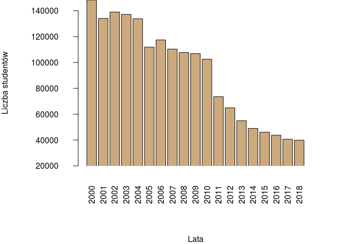<!-- -->

Średnia roczna liczba studentów na uczelniach pedagogicznych:

``` r
mean(tabela$`Uczelnie pedagogiczne`)
```

    ## [1] 92729.05

Wariancja:

``` r
var(tabela$`Uczelnie pedagogiczne`)
```

    ## [1] 1497712204

Odchylenie standardowe:

``` r
sd(tabela$`Uczelnie pedagogiczne`)
```

    ## [1] 38700.29

Rozstęp próby:

``` r
diff(range(tabela$`Uczelnie pedagogiczne`))
```

    ## [1] 108391

Odchylenie przeciętne:

``` r
avg.dev(tabela$`Uczelnie pedagogiczne`)
```

    ## [1] 34627.2

Kwartyle:

``` r
fx <- fivenum(tabela$`Uczelnie pedagogiczne`)
names(fx) <- c("Minimum", "Q1", "Mediana", "Q3", "Maksimum")
fx
```

    ##  Minimum       Q1  Mediana       Q3 Maksimum 
    ##  39902.0  51963.0 106822.0 125604.5 148293.0

Rozstęp międzykwartylowy:

``` r
iqr2(tabela$`Uczelnie pedagogiczne`)
```

    ## [1] 73641.5

Procent liczby studentów na uczelniach pedagogicznych w stosunku do
uczelni wyższych w 2000 roku

``` r
stos2000<-tabela$`Uczelnie pedagogiczne`[1]/ tabela$Ogolem[1]
stos2000*100
```

    ## [1] 10.2351

Procent liczby studentów na uczelniach pedagogicznych w stosunku do
uczelni wyższych w 2018 roku

``` r
stos2018<- tabela$`Uczelnie pedagogiczne`[19]/tabela$Ogolem[19]
stos2018*100
```

    ## [1] 4.065534

<br /> Interpretacja wyników rocznej liczby studentów na uczelniach
pedagogicznych w latach 2000 - 2018: <br /> 1. Wartość kwartyla
pierwszego wyniosła 51 963, co oznacza, że 25% ilości osób studiujących
na uczelniach pedagogicznych w ciągu roku jest mniejsza lub równa tej
wartości, a 75% jest większa. <br /> 2. Wartość kwartyla drugiego
(mediany) wyniosła 106 822, co oznacza, że 50% ilości osób studiujących
na uczelniach pedagogicznych w ciągu roku jest mniejsza lub równa tej
wartości, a 50% jest większa. <br /> 3. Wartość kwartyla trzeciego
wyniosła 125 604.5, co oznacza, że 75% ilości osób studiujących na
uczelniach pedagogicznych w ciągu roku jest mniejsza lub równa tej
wartości, a 25% jest większa. <br /> 4. Odchylenie standardowe wyniosło
38 700.29, co oznacza, że typowa ilość osób studiujących na uczelniach
pedagogicznych w ciągu roku znajduje się w przedziale od 54 028 do 131
430. <br/> 5. Największą ilość studentów na uczelniach pedagogicznych w
liczbie 148 293 zaobserwowano w 2000 roku, a najmniejszą wynoszącą 39
902 w 2018 roku. Rozstęp próby wyniósł więc 108 391. <br/> 6. Liczba
studentów na uczelniach pedagogicznych w stosunku do uczelni wyższych
zmalała o ok. 6 punktów procentowych w latach 2000 - 2018.

## Liczba studentów na uczelniach morskich w latach 2000 - 2018

``` r
par(mar=c(8,8,0,3), mgp=c(7,2,0))
options(scipen=5)
barplot(tabela$`Uczelnie morskie`,xlab="Lata",ylab="Ilość studentów",names.arg=c(2000:2018),las=2,ylim=c(2000,max(tabela$`Uczelnie morskie`)), xpd=FALSE, col="burlywood3", beside=TRUE)
```

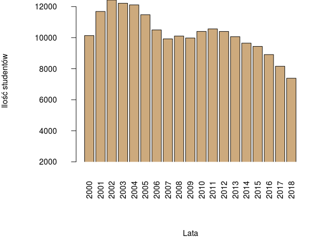<!-- -->

Średnia roczna liczba studentów na uczelniach morskich:

``` r
mean(tabela$`Uczelnie morskie`)
```

    ## [1] 10290.53

Wariancja:

``` r
var(tabela$`Uczelnie morskie`)
```

    ## [1] 1747496

Odchylenie standardowe:

``` r
sd(tabela$`Uczelnie morskie`)
```

    ## [1] 1321.929

Rozstęp próby:

``` r
diff(range(tabela$`Uczelnie morskie`))
```

    ## [1] 5038

Odchylenie przeciętne:

``` r
avg.dev(tabela$`Uczelnie morskie`)
```

    ## [1] 964.9751

Kwartyle:

``` r
fx <- fivenum(tabela$`Uczelnie morskie`)
names(fx) <- c("Minimum", "Q1", "Mediana", "Q3", "Maksimum")
fx
```

    ##  Minimum       Q1  Mediana       Q3 Maksimum 
    ##     7387     9784    10135    11021    12425

Rozstęp międzykwartylowy:

``` r
iqr2(tabela$`Uczelnie morskie`)
```

    ## [1] 1237

Procent liczby studentów na uczelniach morskich w stosunku do uczelni
wyższych w 2000 roku

``` r
stos2000<-tabela$`Uczelnie morskie`[1]/ tabela$Ogolem[1]
stos2000*100
```

    ## [1] 0.6995121

Procent liczby studentów na uczelniach morskich w stosunku do uczelni
wyższych w 2018 roku

``` r
stos2018<- tabela$`Uczelnie morskie`[19]/tabela$Ogolem[19]
stos2018*100
```

    ## [1] 0.7526465

<br /> Interpretacja wyników rocznej liczby studentów na uczelniach
morskich w latach 2000 - 2018: <br /> 1. Wartość kwartyla pierwszego
wyniosła 9 784, co oznacza, że 25% ilości osób studiujących na
uczelniach morskich w ciągu roku jest mniejsza lub równa tej wartości, a
75% jest większa. <br /> 2. Wartość kwartyla drugiego (mediany) wyniosła
10 135, co oznacza, że 50% ilości osób studiujących na uczelniach
morskich w ciągu roku jest mniejsza lub równa tej wartości, a 50% jest
większa. <br /> 3. Wartość kwartyla trzeciego wyniosła 11 021, co
oznacza, że 75% ilości osób studiujących na uczelniach morskich w ciągu
roku jest mniejsza lub równa tej wartości, a 25% jest większa. <br /> 4.
Odchylenie standardowe wyniosło 1 321.929, co oznacza, że typowa ilość
osób studiujących na uczelniach morskich w ciągu roku znajduje się w
przedziale od 8 968 do 11 613. <br/> 5. Największą ilość studentów na
uczelniach morskich w liczbie 12 425 zaobserwowano w 2002 roku, a
najmniejszą wynoszącą 7 387 w 2018 roku. Rozstęp próby wyniósł więc 5
038. <br/> 6. Liczba studentów na uniwersytetach w stosunku do uczelni
wyższych nieznacznie wzrosła o ok. 0.06 punktów procentowych w latach
2000 - 2018.

## Liczba studentów na uniwersytetach medycznych w latach 2000 - 2018

``` r
par(mar=c(8,8,0,3), mgp=c(7,2,0))
options(scipen=5)
barplot(tabela$`Uniwersytety medyczne`,xlab="Lata",ylab="Liczba studentów",names.arg=c(2000:2018),las=2,ylim=c(10000,max(tabela$`Uniwersytety medyczne`)), xpd=FALSE, col="burlywood3", beside=TRUE)
```

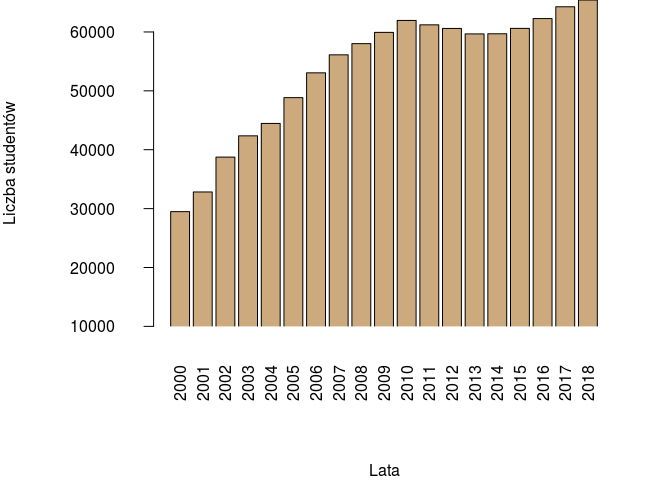<!-- -->

Średnia roczna liczba studentów na uniwersytetach medycznych:

``` r
mean(tabela$`Uniwersytety medyczne`)
```

    ## [1] 53658.84

Wariancja:

``` r
var(tabela$`Uniwersytety medyczne`)
```

    ## [1] 120051042

Odchylenie standardowe:

``` r
sd(tabela$`Uniwersytety medyczne`)
```

    ## [1] 10956.78

Rozstęp próby:

``` r
diff(range(tabela$`Uniwersytety medyczne`))
```

    ## [1] 35936

Odchylenie przeciętne:

``` r
avg.dev(tabela$`Uniwersytety medyczne`)
```

    ## [1] 9035.463

Kwartyle:

``` r
fx <- fivenum(tabela$`Uniwersytety medyczne`)
names(fx) <- c("Minimum", "Q1", "Mediana", "Q3", "Maksimum")
fx
```

    ##  Minimum       Q1  Mediana       Q3 Maksimum 
    ##    29487    46651    59665    60908    65423

Rozstęp międzykwartylowy:

``` r
iqr2(tabela$`Uniwersytety medyczne`)
```

    ## [1] 14257

Procent liczby studentów na uniwersytetach medycznych w stosunku do
uczelni wyższych w 2000 roku

``` r
stos2000<-tabela$`Uniwersytety medyczne`[1]/ tabela$Ogolem[1]
stos2000*100
```

    ## [1] 2.035176

Procent liczby studentów na uniwersytetach medycznych w stosunku do
uczelni wyższych w 2018 roku

``` r
stos2018<- tabela$`Uniwersytety medyczne`[19]/tabela$Ogolem[19]
stos2018*100
```

    ## [1] 6.665818

<br /> Interpretacja wyników rocznej liczby studentów na uniwersytetach
medycznych w latach 2000 - 2018: <br /> 1. Wartość kwartyla pierwszego
wyniosła 46 651, co oznacza, że 25% ilości osób studiujących na
uniwersytetach medycznych w ciągu roku jest mniejsza lub równa tej
wartości, a 75% jest większa. <br /> 2. Wartość kwartyla drugiego
(mediany) wyniosła 59 665, co oznacza, że 50% ilości osób studiujących
na uniwersytetach medycznych w ciągu roku jest mniejsza lub równa tej
wartości, a 50% jest większa. <br /> 3. Wartość kwartyla trzeciego
wyniosła 60 908, co oznacza, że 75% ilości osób studiujących na
uniwersytetach medycznych w ciągu roku jest mniejsza lub równa tej
wartości, a 25% jest większa. <br /> 4. Odchylenie standardowe wyniosło
10 956.78, co oznacza, że typowa ilość osób studiujących na
uniwersytetach medycznych w ciągu roku znajduje się w przedziale od 42
702 do 64 616. <br/> 5. Największą ilość studentów na uniwersytetach
medycznych w liczbie 65 423 zaobserwowano w 2018 roku, a najmniejszą
wynoszącą 29 487 w 2000 roku. Rozstęp próby wyniósł więc 35 936. <br/>
6. Liczba studentów na uniwersytetach medycznych w stosunku do uczelni
wyższych wzrosła o ok. 4.5 punktów procentowych w latach 2000 -
2018.

## Liczba studentów na akademiach wychowania fizycznego w latach 2000 - 2018

``` r
par(mar=c(8,8,0,3), mgp=c(7,2,0))
options(scipen=5)
barplot(tabela$`Akademie wychowania fizycznego`,xlab="Lata",ylab="Liczba studentów",names.arg=c(2000:2018),las=2,ylim=c(10000,max(tabela$`Akademie wychowania fizycznego`)), xpd=FALSE, col="burlywood3", beside=TRUE)
```

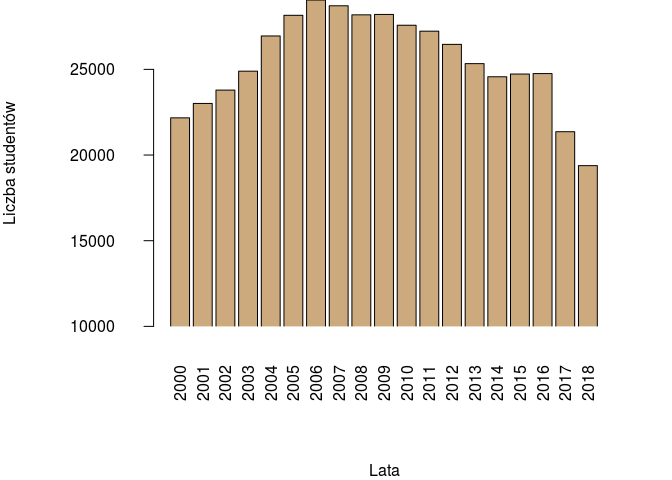<!-- -->

Średnia roczna liczba studentów na akademiach wychowania fizycznego:

``` r
mean(tabela$`Akademie wychowania fizycznego`)
```

    ## [1] 25500.89

Wariancja:

``` r
var(tabela$`Akademie wychowania fizycznego`)
```

    ## [1] 7332810

Odchylenie standardowe:

``` r
sd(tabela$`Akademie wychowania fizycznego`)
```

    ## [1] 2707.916

Rozstęp próby:

``` r
diff(range(tabela$`Akademie wychowania fizycznego`))
```

    ## [1] 9665

Odchylenie przeciętne:

``` r
avg.dev(tabela$`Akademie wychowania fizycznego`)
```

    ## [1] 2212.1

Kwartyle:

``` r
fx <- fivenum(tabela$`Akademie wychowania fizycznego`)
names(fx) <- c("Minimum", "Q1", "Mediana", "Q3", "Maksimum")
fx
```

    ##  Minimum       Q1  Mediana       Q3 Maksimum 
    ##  19383.0  24180.0  25335.0  27865.5  29048.0

Rozstęp międzykwartylowy:

``` r
iqr2(tabela$`Akademie wychowania fizycznego`)
```

    ## [1] 3685.5

Procent liczby studentów na akademiach wychowania fizycznego w stosunku
do uczelni wyższych w 2000 roku

``` r
stos2000<-tabela$`Akademie wychowania fizycznego`[1]/ tabela$Ogolem[1]
stos2000*100
```

    ## [1] 1.53023

Procent liczby studentów na akademiach wychowania fizycznego w stosunku
do uczelni wyższych w 2018 roku

``` r
stos2018<- tabela$`Akademie wychowania fizycznego`[19]/tabela$Ogolem[19]
stos2018*100
```

    ## [1] 1.974895

<br /> Interpretacja wyników rocznej liczby studentów na akademiach
wychowania fizycznego w latach 2000 - 2018: <br /> 1. Wartość kwartyla
pierwszego wyniosła 24 180, co oznacza, że 25% ilości osób studiujących
na akademiach wychowania fizycznego w ciągu roku jest mniejsza lub równa
tej wartości, a 75% jest większa. <br /> 2. Wartość kwartyla drugiego
(mediany) wyniosła 25 335, co oznacza, że 50% ilości osób studiujących
na akademiach wychowania fizycznego w ciągu roku jest mniejsza lub równa
tej wartości, a 50% jest większa. <br /> 3. Wartość kwartyla trzeciego
wyniosła 27 865.5, co oznacza, że 75% ilości osób studiujących na
akademiach wychowania fizycznego w ciągu roku jest mniejsza lub równa
tej wartości, a 25% jest większa. <br /> 4. Odchylenie standardowe
wyniosło 2 707.916, co oznacza, że typowa ilość osób studiujących na
akademiach wychowania fizycznego w ciągu roku znajduje się w przedziale
od 22 729 do 28 209. <br/> 5. Największą ilość studentów na akademiach
wychowania fizycznego w liczbie 29 048 zaobserwowano w 2006 roku, a
najmniejszą wynoszącą 19 383 w 2018 roku. Rozstęp próby wyniósł więc 9
665. <br/> 6. Liczba studentów na akademiach wychowania fizycznego w
stosunku do uczelni wyższych nieznacznie wzrosła o ok. 0.4 punktów
procentowych w latach 2000 - 2018.

## Liczba studentów na uczelniach artystycznych w latach 2000 - 2018

``` r
par(mar=c(8,8,0,3), mgp=c(7,2,0))
options(scipen=5)
barplot(tabela$`Uczelnie artystyczne`,xlab="Lata",ylab="Liczba studentów",names.arg=c(2000:2018),las=2,ylim=c(10000,max(tabela$`Uczelnie artystyczne`)), xpd=FALSE, col="burlywood3", beside=TRUE)
```

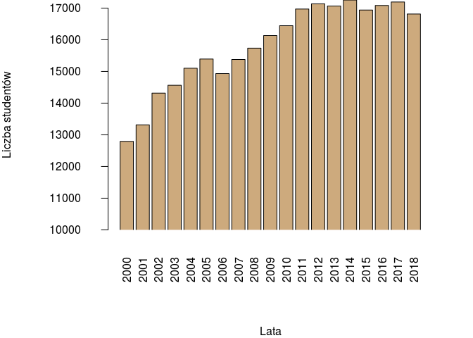<!-- -->

Średnia roczna liczba studentów na uczelniach artystycznych:

``` r
mean(tabela$`Uczelnie artystyczne`)
```

    ## [1] 15818.32

Wariancja:

``` r
var(tabela$`Uczelnie artystyczne`)
```

    ## [1] 1879650

Odchylenie standardowe:

``` r
sd(tabela$`Uczelnie artystyczne`)
```

    ## [1] 1371.003

Rozstęp próby:

``` r
diff(range(tabela$`Uczelnie artystyczne`))
```

    ## [1] 4462

Odchylenie przeciętne:

``` r
avg.dev(tabela$`Uczelnie artystyczne`)
```

    ## [1] 1141.247

Kwartyle:

``` r
fx <- fivenum(tabela$`Uczelnie artystyczne`)
names(fx) <- c("Minimum", "Q1", "Mediana", "Q3", "Maksimum")
fx
```

    ##  Minimum       Q1  Mediana       Q3 Maksimum 
    ##  12793.0  15016.5  16132.0  17017.5  17255.0

Rozstęp międzykwartylowy:

``` r
iqr2(tabela$`Uczelnie artystyczne`)
```

    ## [1] 2001

Procent liczby studentów na uczelniach artystycznych w stosunku do
uczelni wyższych w 2000 roku

``` r
stos2000<-tabela$`Uczelnie artystyczne`[1]/ tabela$Ogolem[1]
stos2000*100
```

    ## [1] 0.8829658

Procent liczby studentów na uczelniach artystycznych w stosunku do
uczelni wyższych w 2018 roku

``` r
stos2018<- tabela$`Uczelnie artystyczne`[19]/tabela$Ogolem[19]
stos2018*100
```

    ## [1] 1.713043

<br /> Interpretacja wyników rocznej liczby studentów na uczelniach
artystycznych w latach 2000 - 2018: <br /> 1. Wartość kwartyla
pierwszego wyniosła 15 016.5, co oznacza, że 25% ilości osób
studiujących na uczelniach artystycznych w ciągu roku jest mniejsza lub
równa tej wartości, a 75% jest większa. <br /> 2. Wartość kwartyla
drugiego (mediany) wyniosła 16 132, co oznacza, że 50% ilości osób
studiujących na uczelniach artystycznych w ciągu roku jest mniejsza lub
równa tej wartości, a 50% jest większa. <br /> 3. Wartość kwartyla
trzeciego wyniosła 17 017.5, co oznacza, że 75% ilości osób studiujących
na uczelniach artystycznych w ciągu roku jest mniejsza lub równa tej
wartości, a 25% jest większa. <br /> 4. Odchylenie standardowe wyniosło
1 371.003, co oznacza, że typowa ilość osób studiujących na uczelniach
artystycznych w ciągu roku znajduje się w przedziale od 14 447 do 17
190. <br/> 5. Największą ilość studentów na uczelniach artystycznych w
liczbie 17 255 zaobserwowano w 2014 roku, a najmniejszą wynoszącą 12 793
w 2000 roku. Rozstęp próby wyniósł więc 4 462. <br/> 6. Liczba studentów
na uczelniach artystycznych w stosunku do uczelni wyższych wzrosła o ok.
1 punkt procentowy w latach 2000 - 2018.

## Liczba studentów na uczelniach teologicznych w latach 2000 - 2018

``` r
par(mar=c(8,8,0,3), mgp=c(7,2,0))
options(scipen=5)
barplot(tabela$`Uczelnie teologiczne`,xlab="Lata",ylab="Ilość studentów",names.arg=c(2000:2018),las=2,ylim=c(2000,max(tabela$`Uczelnie teologiczne`)), xpd=FALSE, col="burlywood3", beside=TRUE)
```

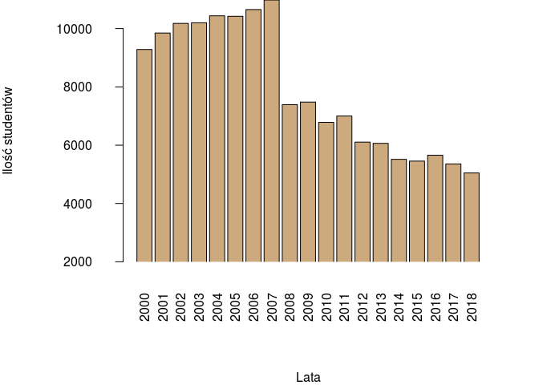<!-- -->

Średnia roczna liczba studentów na uczelniach teologicznych:

``` r
mean(tabela$`Uczelnie teologiczne`)
```

    ## [1] 7887.316

Wariancja:

``` r
var(tabela$`Uczelnie teologiczne`)
```

    ## [1] 4800713

Odchylenie standardowe:

``` r
sd(tabela$`Uczelnie teologiczne`)
```

    ## [1] 2191.053

Rozstęp próby:

``` r
diff(range(tabela$`Uczelnie teologiczne`))
```

    ## [1] 5932

Odchylenie przeciętne:

``` r
avg.dev(tabela$`Uczelnie teologiczne`)
```

    ## [1] 1989.629

Kwartyle:

``` r
fx <- fivenum(tabela$`Uczelnie teologiczne`)
names(fx) <- c("Minimum", "Q1", "Mediana", "Q3", "Maksimum")
fx
```

    ##  Minimum       Q1  Mediana       Q3 Maksimum 
    ##   5048.0   5860.0   7392.0  10188.5  10980.0

Rozstęp międzykwartylowy:

``` r
iqr2(tabela$`Uczelnie teologiczne`)
```

    ## [1] 4328.5

Procent liczby studentów na uczelniach teologicznych w stosunku do
uczelni wyższych w 2000 roku

``` r
stos2000<-tabela$`Uczelnie teologiczne`[1]/ tabela$Ogolem[1]
stos2000*100
```

    ## [1] 0.6407075

Procent liczby studentów na uczelniach teologicznych w stosunku do
uczelni wyższych w 2018 roku

``` r
stos2018<- tabela$`Uczelnie teologiczne`[19]/tabela$Ogolem[19]
stos2018*100
```

    ## [1] 0.5143305

<br /> Interpretacja wyników rocznej liczby studentów na uczelniach
teologicznych w latach 2000 - 2018: <br /> 1. Wartość kwartyla
pierwszego wyniosła 5 860, co oznacza, że 25% ilości osób studiujących
na uczelniach teologicznych w ciągu roku jest mniejsza lub równa tej
wartości, a 75% jest większa. <br /> 2. Wartość kwartyla drugiego
(mediany) wyniosła 7 392, co oznacza, że 50% ilości osób studiujących na
uczelniach teologicznych w ciągu roku jest mniejsza lub równa tej
wartości, a 50% jest większa. <br /> 3. Wartość kwartyla trzeciego
wyniosła 10 188.5, co oznacza, że 75% ilości osób studiujących na
uczelniach teologicznych w ciągu roku jest mniejsza lub równa tej
wartości, a 25% jest większa. <br /> 4. Odchylenie standardowe wyniosło
2 191.053, co oznacza, że typowa ilość osób studiujących na uczelniach
teologicznych w ciągu roku znajduje się w przedziale od 5 696 do 10 079.
<br/> 5. Największą ilość studentów na uczelniach teologicznych w
liczbie 10 980 zaobserwowano w 2007 roku, a najmniejszą wynoszącą 5 048
w 2018 roku. Rozstęp próby wyniósł więc 5 932. <br/> 6. Liczba studentów
na uczelniach teologicznych w stosunku do uczelni wyższych zmalała
nieznacznie o ok. 0.13 punktów procentowych w latach 2000 - 2018.

## Wnioski

<br />Trend Liczby studentów na przestrzeni lat jest wyraźnie spadkowy.
Na taki stan rzeczy może wpływać wiele czynników. Wykres przedstawiający
zależność liczby studentów od liczby maturzystów sugeruje korelacje.
Zmniejszająca się liczba maturzystów to głównie skutek niżu
demograficznego, co za tym idzie również studentów. Możnaby się również
zastanowić czy maksimum obecne w 2004 roku może mieć powiązanie z
wejściem wtedy Polski do Unii Europejskiej. Wbrew temu trendowi,
uczelnie artystyczne oraz uniwersytety medyczne doświadczają znacznego
przyrostu w liczbie studentów. Przyczyną wzrostu tych drugich może być
rosnące zapotrzebowanie lekarzy, wysoki prestiż kierunków około
medycznych oraz znaczący rozwój medycyny.

<br/> W pozostałych typach uczelni można zauważyć spadek liczby
studentów. Największy rozstęp próby zaobserwowano na uczelniach
ekonomicznych. Wyniósł on 238 457. Liczba studentów na tych uczelniach
zaczęła znacznie maleć od 2005 roku. Od tego samego roku zaczęła również
maleć liczba osób studiujących na uczelniach rolniczych. Ilość studentów
zmniejszyła się z ponad 100 000 do ok. 56 000, czyli spadła o ok.
połowę. Może to być spowodowane zmianą stylu życia oraz zmniejszeniem
popularności tych kierunków. Kolejnym typem uczelni, na którym
zaobserwowano znaczny spadek liczby studentów są uczelnie teologiczne.
Od 2007 roku ilość ta zmniejszyła się dwukrotnie od ok. 10 000 do 5 000.

<br/> Mimo zmniejszającej się liczby studentów uniwersytety, uczelnie
techniczne, medyczne i artystyczne zanotowały procentowy wzrost liczby
studentów względem innych typów uczelni na przestrzeni badanych lat, co
wskazuje na wzrost ich popularności.

<br/>Podsumowując uczelnie wyższe wciąż przyciągają szerogie grono
studentów. Dzięki nim mogą oni postawić pierwsze kroki na rynku pracy,
poznać wielu ciekawych ludzi i przede wszystkim się rozwijać. <br/>
<br/> <br/>
<br/>

## Projekt wykonali:

### [Aleksandra Mazur](https://github.com/alexmaz99), [Grzegorz Poręba](https://github.com/Wokstym)

<br/> <br/> <br/> <br/>
